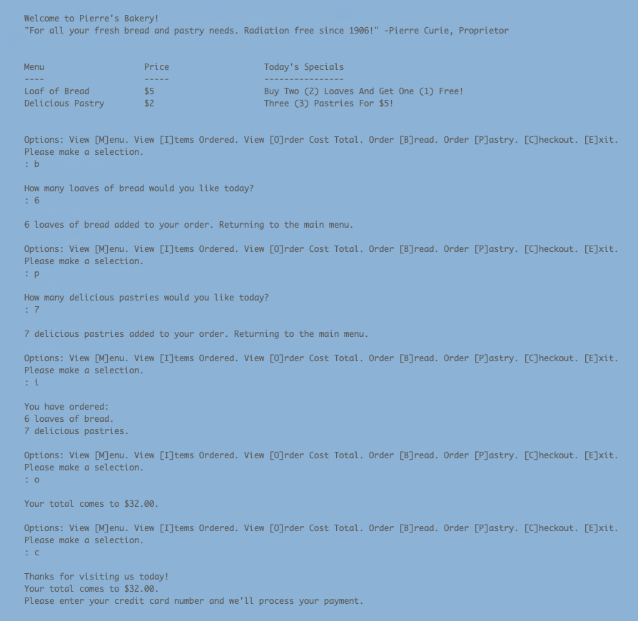

# Pierre's Bakery
## By Usarneme/Tom

---

### Project Description

This project is a console application for Pierre's Bakery. It allows you to order bread and pastries, see your total, and checkout once you are done adding items to your order.

---
### Tech Stack
1. C#
2. .NET5
3. MSTest
4. Bash script (for project setup)
---
### Project Build/Run Instructions
1. Clone this repository via `git clone https://github.com/Usarneme/PierresBakery.Solution`
2. Enter the newly created directory via `cd PierresBakery.Solution`
3. Enter the project directory `cd PierresBakery` and install requirements via `dotnet restore`
3a. (Optional) If you want to run the Test Suite, enter the test directory `cd PierresBakery.Tests` and run `dotnet restore`
4. From within the PierresBakery directory, to run the application first run `dotnet build` then `dotnet run`
---

### Requirements
1. C# - instructions for installing can be found at https://www.geeksforgeeks.org/how-to-install-and-setup-visual-studio-for-c-sharp/
2. .NET - instructions for installing can be found at https://docs.microsoft.com/en-us/dotnet/framework/install/guide-for-developers
3. A terminal/command line application such as iTerm on Mac or CMD/GitBash on Windows
---

### Project Demo
You can see most of the application's functionality in the included screenshot:

### Known Issues:
1. NO KNOWN ISSUES
2. Please open a pull request if you have any issues!
---

### License is GPLv3 and I make no claim to copyright.
 
 
 
 
 

  <small>Made with ❤️ in Portland, Oregon. </small>

